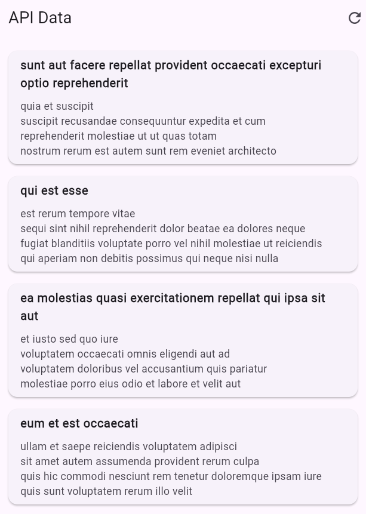

# Flutter API Lab

A simple Flutter app that demonstrates fetching and displaying data from a REST API using the [jsonplaceholder](https://jsonplaceholder.typicode.com/) service.

## Features

- Fetches a list of posts from a public API
- Displays posts in a clean, scrollable list
- Pull-to-refresh and retry on error
- Error handling with user-friendly messages

## Screenshots



## Getting Started

### Prerequisites

- [Flutter SDK](https://docs.flutter.dev/get-started/install)
- Android Studio or VS Code
- An Android/iOS emulator or a real device

### Installation

1. **Clone the repository:**
   ```
   git clone https://github.com/your-username/flutter_api_lab.git
   cd flutter_api_lab
   ```

2. **Install dependencies:**
   ```
   flutter pub get
   ```

3. **Run the app:**
   ```
   flutter run
   ```

## Project Structure

- `lib/main.dart` - Main application code
- `lib/post_model.dart` - Data model for posts

## API Used

- [jsonplaceholder.typicode.com/posts](https://jsonplaceholder.typicode.com/posts)

## Customization

You can change the API endpoint or enhance the UI as needed.

## License

This project is open source and available under the [MIT License](LICENSE).

---

Made with ❤️ in Flutter.